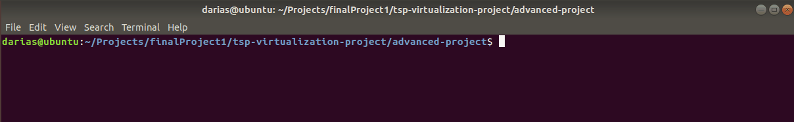
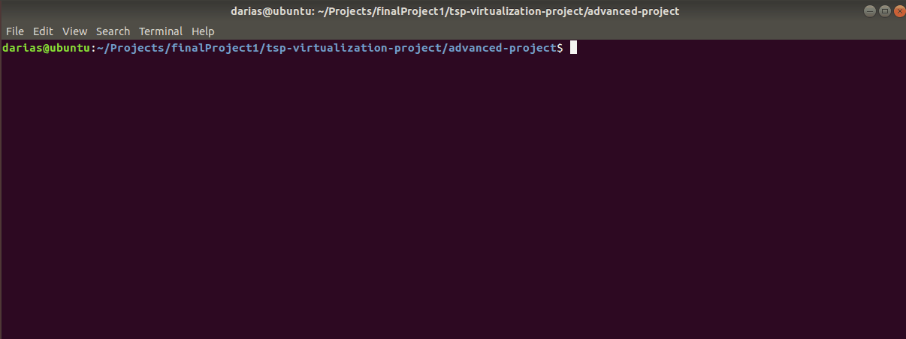
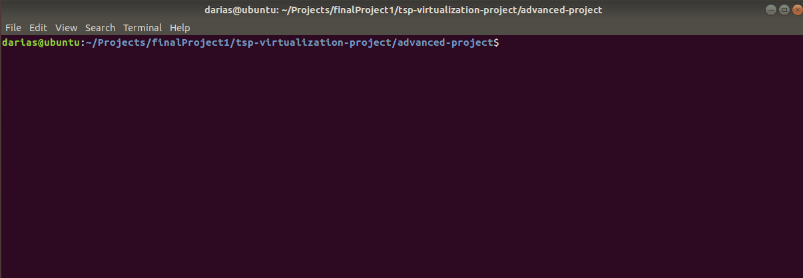
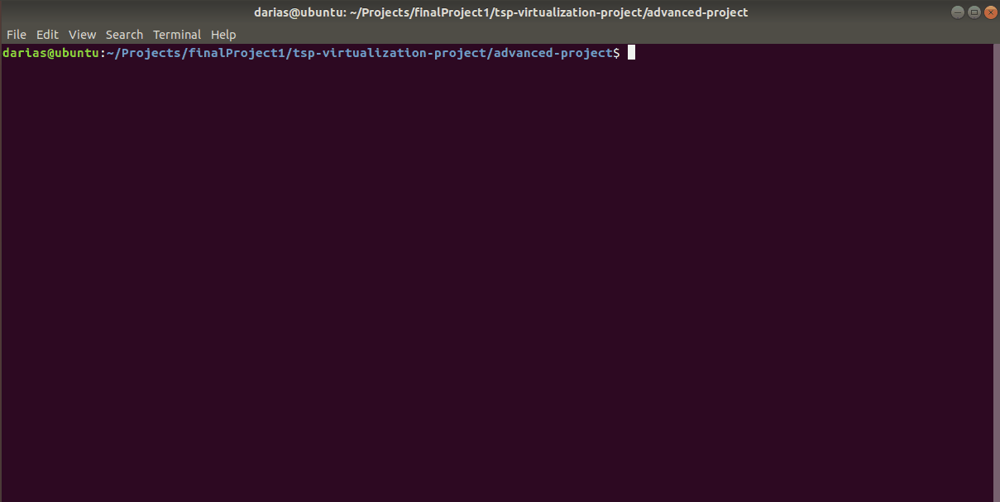
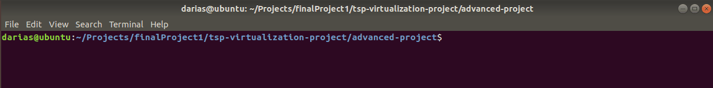
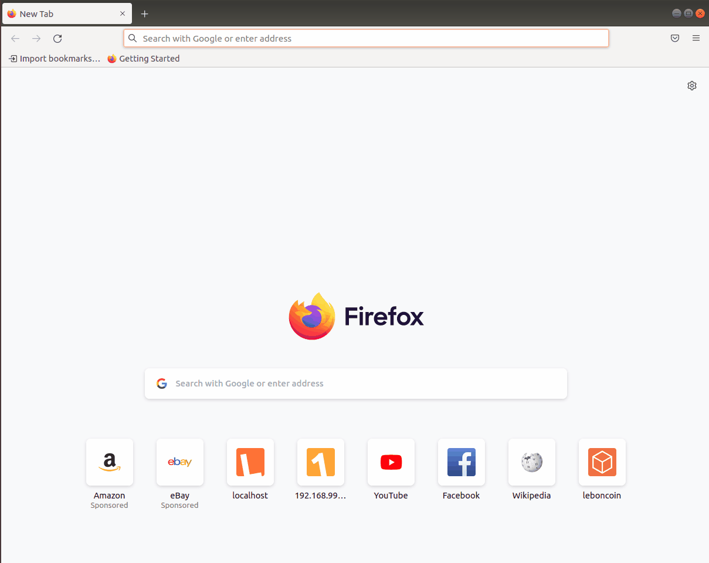

# Advanced mongodb project
In the advanced project I start with the same structure as the basic project, that is, a MongoDB being managed by Mongo-express, however, there are certain differences and improvements.

1. In this implementation we will no longer use a deployment for MongoDB, but we will use a statefulset. This is the recommended way of working with databases or any application in which new requests may become dependent on previous ones. I am not inventing the wheel, so I am using a statefulset that MongoDB provides and adapting it to the needs of the project.

2. In the statefulset I also download a new container called mongo-exporter, this container serves to translate the metrics provided by MongoDB so that they can be understood by Prometheus.

3. I use service accounts to have better authentication control by the statefulset.

4. I implement a ServiceMonitor which, together with a new internal service, is in charge of sending the metrics obtained from MongoDB to Prometheus.

5. I have two databases, one for backup and load balancing, with 2 replicas for each.

Regarding the whole monitoring section, I am using Prometheus and Grafana as previously mentioned.
Prometheus is the receiver of the metrics to store them within its database and then we use graphana to interpret and graph this data. I found the difference that to implement Prometheus within Kubernetes it is necessary to first implement a Prometheus-operator, which is in charge of controlling and orchestrating all the ServiceMonitors to make the data be transferred to Prometheus. All the implementations of this section are being done based on crds (operators), these operators are necessary to carry out the implementation of everything that the namespace monitoring will contain.

I'm not going to go into much detail on what each Prometheus and Grafana file contains because it's not part of the project (and also because it took me about two weeks to understand most of them).


<p align="center">

</p>

## Installation
In this implementation we will need more resources, so I highly recommend that the minikube be started with the following resources.

1. Initialize minikube
```bash
minikube start --cpus 4 --memory 8192 --vm-driver virtualbox
```


Vamos a empezar implementando todo el namespace de monitoring, el proceso será el siguiente:

1. Create all the crds (operators).
2. Implementation of prometheus-operator.
3. Prometheus implementation.
4. Grafana implementation.

We can apply all the files at the same. But I recommend doing it in the following order because we need the crds to create the Prometheus-operator and we need the operator to implement our prometheus.

2. Apply all deployment files
```bash
kubectl apply -f crds/
kubectl apply -f prometheus-operator/
kubectl apply -f prometheus/
kubectl apply -f grafana/
```

Time to verify that our monitoring namespace is running properly.

3. Get the information about the namespace in which you are working. In this case monitoring. It may take a moment to deploy everything.

```bash
kubectl get all -n monitoring
```



4. After making sure that our namespace monitoring is running correctly, I proceed to install the database namespace.

```bash
kubectl apply -f advanced-mongodb/
```
And we also verify that everything is up. At this moment it is likely that there are CrashLoopBackOff in mongo-express, this is because it is trying to authenticate with MongoDB but it has not finished deploying yet. This can be solved with a sleep inside the mongo-express deployment, but it still works, the POD will only restart once or twice.



After making sure that our PODs and deployments are up, we can use our NodePort to access our external service ( mongo-express ).

5. Using minikube to access our NodePort.

```bash
minikube service -n database mongo-express
```


As you can see in the diagram, grafana does not have an external service assigned. We can create it or we can also access the service using a port-forward.

6. Accessing grafana using port-forward.

```bash
kubectl port-forward -n monitoring deployment.apps/grafana 3000
```


After this we can access grafana as localhost.



To visualize the mongoDB metrics in its respective dashboard we need two things:
a. Add prometheus as a database.

```bash
http://prometheus-operated.monitoring:9090
```

b. Import the MongoDB dashboard.
```bash
12594 
```
7. It has been a long process. But at this moment we are already able to visualize the dashboard of our database.


### Voilà!