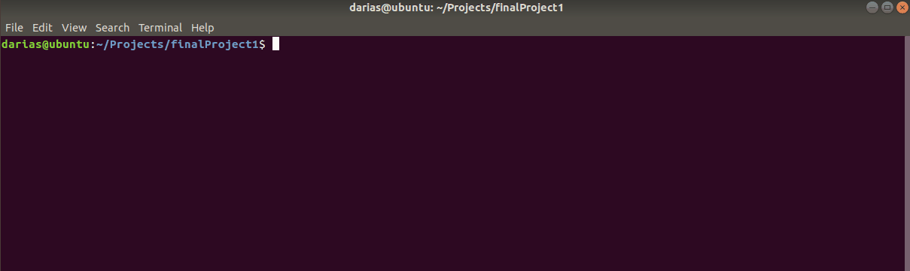

# Basic mongodb project
In the basic project we are going to set up a MongoDB environment and manage the database using Mongo-express.

## Installation
In this scenario, it is not so necessary to have so many resources, but I always start my minkube with assigned resources to know how much I have to work with.

1. Initialize minikube
```bash
minikube start --cpus 4 --memory 8192 --vm-driver virtualbox
```

I am not going to explain here how each of the files for the deployment works (configmap, deployment, secrets, service, etc.) because I was not asked to deliver that as my project. But if you are interested you can investigate them separately. The implementation contains 7 files, which are:

1. Namespace
2. Configmap
3. Secret
4. Mongodb deployment
5. Mongodb internal service
6. Mongo-express deployment
7. Mongo-express NodePort service

We can apply all the files at the same.

2. Apply all deployment files
```bash
kubectl apply -f basic-mongodb/
```


Make sure the deployment is running correctly.

2. Get the information about the namespace in which you are working. In this case database.
```bash
kubectl get all -n database
```


